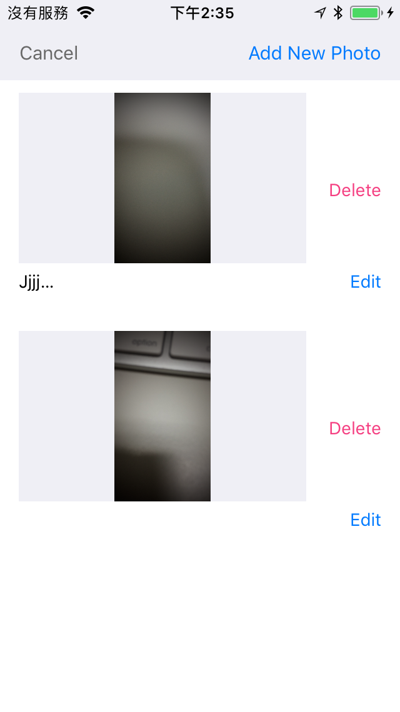
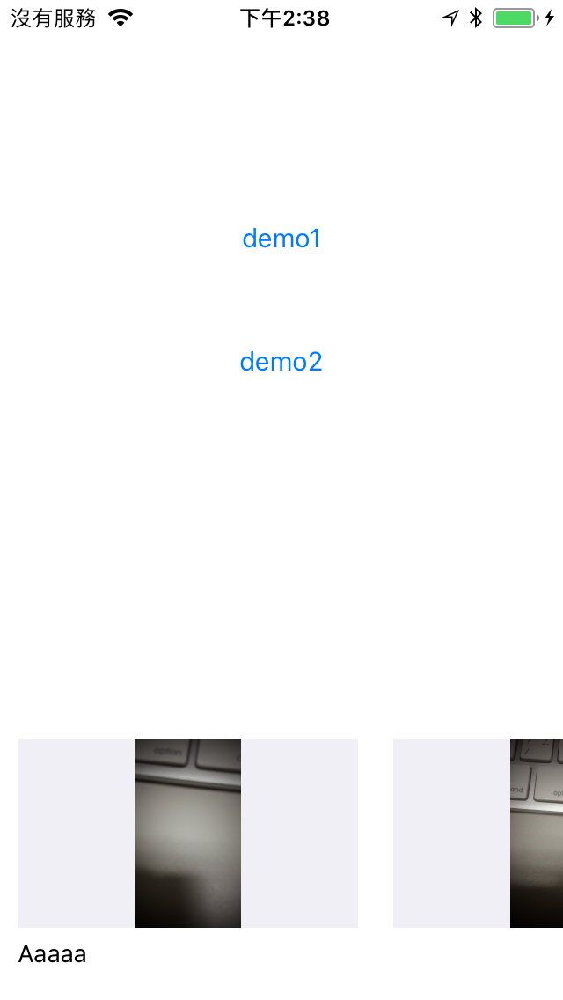
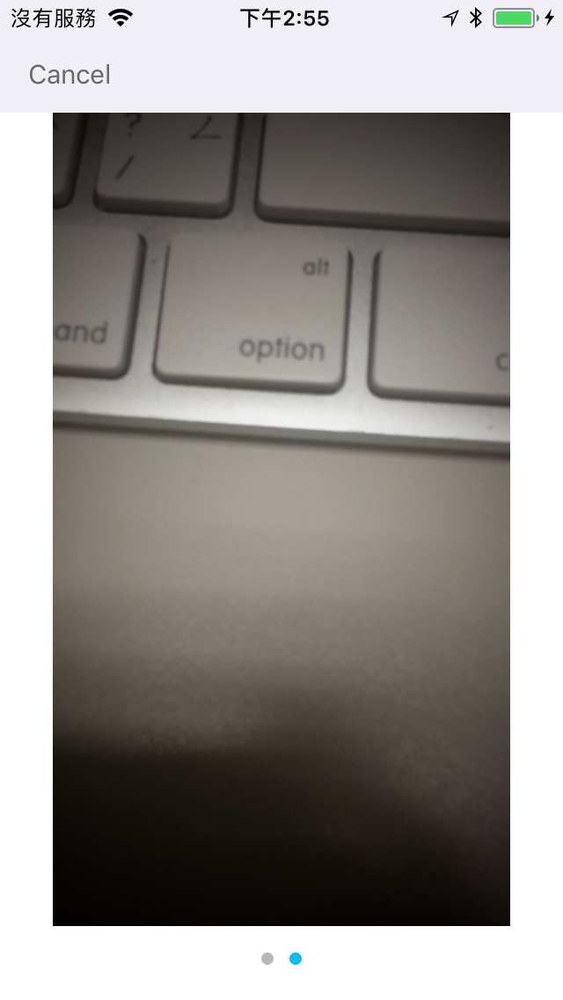

# IRPhotoGallery 

- IRPhotoGallery is a powerful photo gallery for iOS.

## Features
- Support multiple gallery modes.
    - Horizontal
    - Vertical
    - Normal
    - Deletable
    - Scalable
    - HasButton
    - NoButton
- Full screen gallery.
- Customable functions.
- Amazing camera.

## Install
### Git
- Git clone this project.
- Copy this project into your own project.
- Add the .xcodeproj into you  project and link it as embed framework.
#### Options
- You can remove the `demo` and `ScreenShots` folder.

### Cocoapods
- Add `pod 'IRPhotoGallery'`  in the `Podfile`
- `pod install`

## Usage

### Basic

- Use `PhotoManageViewController`, it include multi parts: Gallery, Preview, Camera, Album, Filters, etc... 
```obj-c
NSBundle *bundle = [NSBundle bundleForClass:[PhotoManageViewController class]];
photoManageViewController = [[PhotoManageViewController alloc] initWithNibName:@"PhotoManageViewController" bundle:bundle];
photoManageViewController.delegate = self;
photoManageViewController.cameraDelegate = self;
[IRCameraColor setTintColor: [UIColor whiteColor]];

[self.navigationController pushViewController:photoManageViewController animated:YES];
```

- Use `PhotoManageBrowser`, it just a gallery view
```objc
photoManageBrowser = [[PhotoManageBrowser alloc] init];
[photoManageBrowser setStyle:Normal];
[photoManageBrowser setDirection:ScrollDirectionHorizontal];
__weak ViewController* wSelf = self;
[photoManageBrowser setItemSelectedBlock:^(NSIndexPath *indexPath) {
    NSBundle *bundle = [NSBundle bundleForClass:[PhotoGalleryViewController class]];
    PhotoGalleryViewController* photoGalleryViewController = [[PhotoGalleryViewController alloc] initWithNibName:@"PhotoGalleryViewController" bundle:bundle];
    photoGalleryViewController.delegate = wSelf;
    photoGalleryViewController.imageIndex = indexPath.row;
    [wSelf presentViewController:photoGalleryViewController animated:YES completion:nil];
}];
photoManageBrowser.delegate = self;
[self.view addSubview:photoManageBrowser];
```

- PhotoManageBrowserStyle
|PhotoManageViewController | Normal | Deletable | Scalable |

```objc
[photoManageBrowser setStyle:Normal];
```

- PhotoManageBrowserStyle
|PhotoManageBrowserScrollDirection | ScrollDirectionVertical | ScrollDirectionHorizontal |

```objc
[photoManageBrowser setDirection:ScrollDirectionHorizontal];
```

- Delegates
```objc
#pragma mark - PhotoManageBrowserDelegate
- (NSUInteger)numberOfPhotos {
    return photos.count;
}

- (NSString *)titleOfPhotoWithIndex:(NSInteger)index {
    return [photos objectAtIndex:index].note;
}

- (id)imageOrPathStringOfPhotoWithIndex:(NSInteger)index {
    
    return [images objectAtIndex:index];
}

#pragma mark - CameraViewControllerDelegate
- (void)didTakePhoto:(UIImage *)image Note:(NSString *)note {
    Photo *photo = [NSEntityDescription insertNewObjectForEntityForName:@"Photo" inManagedObjectContext:context];
    photo.photo = UIImagePNGRepresentation(image);
    photo.note = note;
    [(AppDelegate *)[[UIApplication sharedApplication] delegate] saveContext];
    [self reloadPhotos];
    [photoManageViewController reloadUI];
}

- (void)doUpdatePhoto:(UIImage *)image Note:(NSString *)note Completed:(nullable IRCompletionBlock)completedBlock {
    [photoManageViewController showLoading:YES];
    NSInteger index = [images indexOfObject:image];
    Photo *photo = [photos objectAtIndex:index];
    photo.photo = UIImagePNGRepresentation(image);
    photo.note = note;
    [(AppDelegate *)[[UIApplication sharedApplication] delegate] saveContext];
    if (completedBlock) {
        completedBlock(YES);
    }
    [photoManageViewController reloadUI];
    [photoManageViewController showLoading:NO];
}

- (void)doDeletePhoto:(UIImage *)image {
    NSInteger index = [images indexOfObject:image];
    Photo *photo = [photos objectAtIndex:index];
    [context deleteObject:photo];
    [(AppDelegate *)[[UIApplication sharedApplication] delegate] saveContext];
    [self reloadPhotos];
    [photoManageViewController reloadUI];
}
```

### Advanced settings

- Customize functions of  `PhotoManageBrowser`, 4 blocks let you override the default feature
```objc
@property (nonatomic, copy) CurrentPageChangedBlock currentPageChangedBlock;
@property (nonatomic, copy) ItemSelectedBlock itemSelectedBlock;
@property (nonatomic, copy) DeleteClickBlock deleteClickBlock;
@property (nonatomic, copy) EditClickBlock editClickBlock;
```

- Use `PhotoGalleryViewController`, it is a simple gallery view controller
```obj-c
NSBundle *bundle = [NSBundle bundleForClass:[PhotoGalleryViewController class]];
PhotoGalleryViewController* photoGalleryViewController = [[PhotoGalleryViewController alloc] initWithNibName:@"PhotoGalleryViewController" bundle:bundle];
photoGalleryViewController.delegate = wSelf;
photoGalleryViewController.imageIndex = indexPath.row;
[wSelf presentViewController:photoGalleryViewController animated:YES completion:nil];
```

## Screenshots
| PhotoManageViewController | PhotoManageBrowser |
|:---:|:---:|
||| 
| Camera | Album |
||| 
| PhotoGalleryViewController | Full Screen Gallery |
||| 
